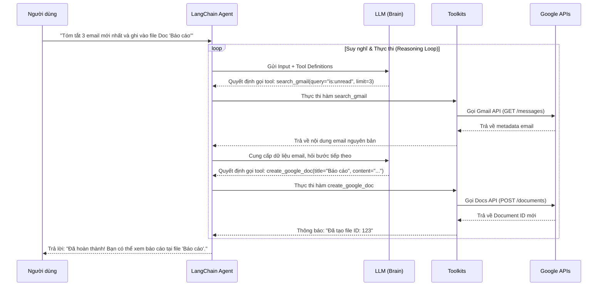

# Kiến Trúc và Luồng Hoạt Động - Google Workspace AI Agent

Tài liệu này mô tả chi tiết cách thức hệ thống Agentic AI hoạt động để tương tác với các dịch vụ trong Google Workspace (Gmail, Sheets, Docs, Calendar) thông qua LangChain.

## 1. Sơ đồ Kiến trúc (High-Level Architecture)

Hệ thống được xây dựng theo mô hình **Agentic Tool-Calling**, nơi LLM đóng vai trò là "bộ não" điều khiển các công cụ chuyên biệt.

```mermaid
graph TD
    User((Người dùng)) -->|Yêu cầu tự nhiên| Agent[AI Agent - LangChain]
    
    subgraph Core_Intelligence [Bộ não AI]
        Agent <--> LLM[Large Language Model - Gemini/GPT]
    )
    
    subgraph Tool_Layer [Lớp Công cụ]
        Agent --> G_Gmail[Gmail Tool]
        Agent --> G_Calendar[Calendar Tool]
        Agent --> G_Sheets[Sheets Tool]
        Agent --> G_Docs[Docs Tool - Custom]
    )
    
    subgraph Auth_Layer [Xác thực & Bảo mật]
        G_Gmail & G_Calendar & G_Sheets & G_Docs --> OAuth[OAuth 2.0 / token.json]
    )
    
    subgraph Google_Workspace_API [Hệ sinh thái Google]
        OAuth --> API_Gmail[Gmail API]
        OAuth --> API_Cal[Calendar API]
        OAuth --> API_Sheets[Sheets API]
        OAuth --> API_Docs[Docs API]
    )
```

### Các thành phần chính:
1.  **Agent (LangChain Executor):** Quản lý trạng thái, lịch sử hội thoại và điều phối giữa LLM và các công cụ.
2.  **LLM (Gemini 2.0 Flash):** Nhận diện ý định (Intent Recognition), trích xuất tham số (Entity Extraction) và quyết định công cụ nào cần gọi.
3.  **Tool Layer:** Các hàm wrapper bọc quanh Google API, cung cấp mô tả (metadata) để LLM hiểu cách dùng.
4.  **Auth Layer:** Quản lý luồng đăng nhập OAuth 2.0, cấp quyền (Scopes) và làm mới Access Token.

---

## 2. Luồng Hoạt động (Execution Flow)

Luồng xử lý từ khi nhận yêu cầu đến khi trả kết quả được thực hiện theo quy trình lặp (Iterative Loop).



### Giải thích các bước:
- **Bước 1: Phân tích Ý định:** LLM phân tích câu lệnh phức tạp của người dùng thành các nhiệm vụ nhỏ.
- **Bước 2: Gọi Công cụ (Tool Calling):** Thay vì tự trả lời, LLM phát ra một tín hiệu (Function Call) yêu cầu Agent thực thi code Python thật.
- **Bước 3: Tương tác API:** Agent sử dụng các thư viện khách của Google để đọc/ghi dữ liệu thực tế.
- **Bước 4: Tổng hợp (Observation):** Kết quả từ API được đưa ngược lại vào ngữ cảnh của LLM để nó "nhìn thấy" dữ liệu và đưa ra quyết định cho bước tiếp theo.

---

## 3. Khả năng tương tác (Capabilities)

| Dịch vụ | Chức năng hỗ trợ |
| :--- | :--- |
| **Gmail** | Đọc email, tìm kiếm theo nhãn/người gửi, gửi mail mới, tạo bản nháp, đánh dấu đã đọc. |
| **Calendar** | Xem lịch biểu, tạo sự kiện mới, sửa thời gian họp, xóa lịch, kiểm tra lịch trống. |
| **Sheets** | Đọc dữ liệu từ ô (Cell), cập nhật bảng tính, thêm hàng mới (Append), tạo bảng tính mới. |
| **Docs** | Tạo tài liệu, thêm nội dung (Document Generation), đọc và tóm tắt văn bản dài. |

---

## 4. Quản lý trạng thái (Memory & State)

- **Short-term Memory:** Agent lưu trữ lịch sử các bước trung gian (Intermediate Steps) để biết mình đã gọi công cụ gì và kết quả ra sao trong cùng một yêu cầu.
- **Conversation Buffer:** Lưu lại nội dung chat trước đó để hỗ trợ các câu hỏi liên quan như "Nó nằm ở đâu?" (Nó = file Doc vừa tạo).
