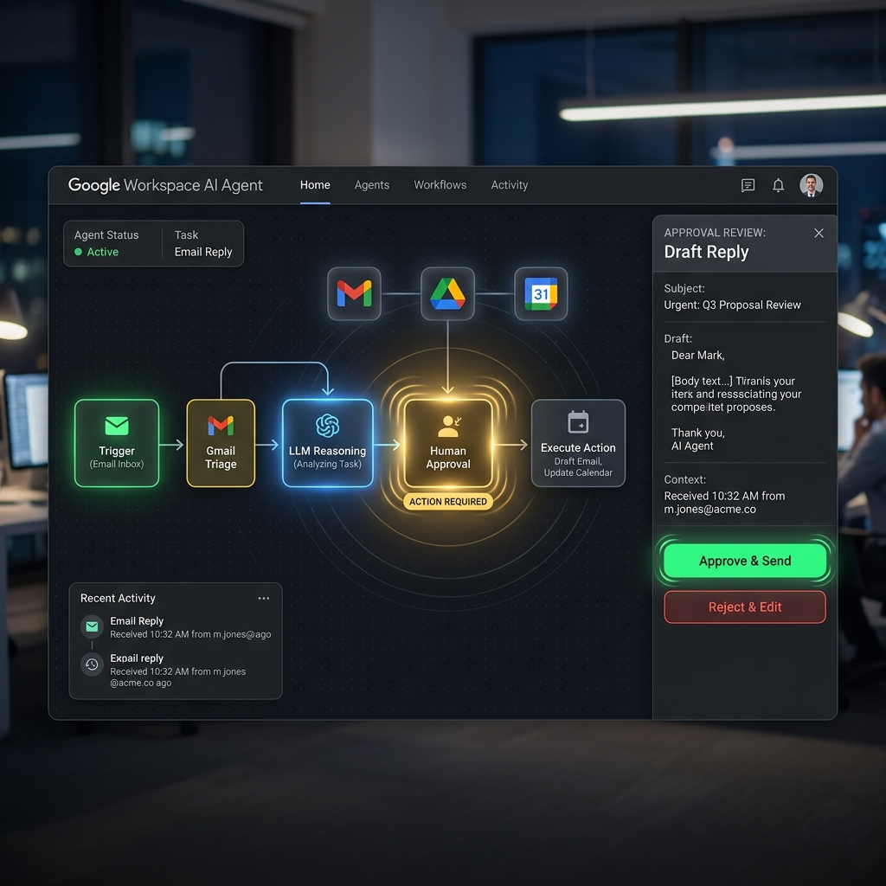
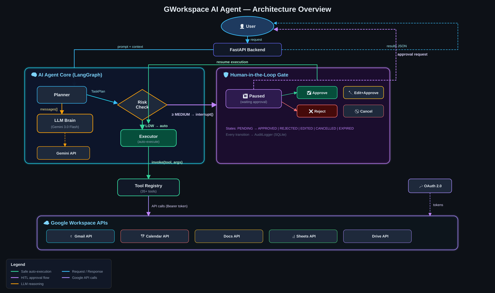

# Google Workspace AI Agent with Human-in-the-Loop


Automate your Google Workspace workflows safely with a smart AI agent featuring built-in Human-in-the-Loop (HITL) approval. Built for teams and professionals who want to delegate tedious tasks like email triaging, document summarization, and calendar management without losing control over critical actions. Safely execute 100+ Workspace actions with 1-click approvals.



## Architecture Overview



## Key Features
*   **Draft and send emails autonomously** while keeping you in the loop for final review and approval.
*   **Schedule and manage Calendar events** without manual data entry, reducing scheduling conflicts.
*   **Summarize long Docs and Sheets** into actionable insights in seconds using Google GenAI.
*   **Enforce secure Human-in-the-Loop (HITL)** checkpoints for any mutating actions (sending, deleting, sharing).
*   **Maintain persistent state across sessions** using LangGraph's checkpointer, ensuring long-running tasks survive restarts.
*   **Deploy instantly as a REST API** powered by FastAPI, ready for integration into any internal tooling.

## Quick Start
Get the agent running and authenticate your Google Workspace account in under 5 minutes.

1. **Install and setup environment**
   ```bash
   git clone https://github.com/your-org/gworkspace-ai-agent.git
   cd gworkspace-ai-agent
   pip install -e .
   cp .env.example .env
   ```
2. **Start the API Server**
   ```bash
   uvicorn backend.main:app --reload
   ```
3. **Trigger your first workflow**
   ```bash
   curl -X POST "http://localhost:8000/api/v1/workflows/email-triage" -H "Content-Type: application/json" -d '{"user_query": "Draft a reply to the latest email from John."}'
   ```
   **Expected Output:**
   ```json
   {
     "status": "pending_approval",
     "action": "gmail_send",
     "draft_preview": "Hi John, I will look into this and get back to you by tomorrow...",
     "approval_url": "http://localhost:8000/api/v1/approve/12345"
   }
   ```
   *The agent drafted the email and paused, waiting for your approval before sending.*

## Installation

### Method 1: Using pip (Recommended)
```bash
git clone https://github.com/your-org/gworkspace-ai-agent.git
cd gworkspace-ai-agent
pip install -e .
```

### Method 2: Using Virtual Environment
```bash
python3 -m venv venv
source venv/bin/activate
pip install -r requirements.txt
```

## Usage Examples

### Example 1: Basic Email Summarization
**Problem:** You have 50 unread emails and need a quick summary.
```python
from agent.core import WorkspaceAgent

agent = WorkspaceAgent()
response = agent.run("Summarize my top 5 unread emails from today.")
print(response)
```
**Output:** `"1. Project update from Sarah (Action required). 2. Newsletter from DevOps Weekly..."`
*The agent securely reads only the required emails and provides a concise digest.*

### Example 2: Human-in-the-Loop Document Deletion
**Problem:** You want the agent to clean up old files, but you must approve deletions.
```python
workflow_id = agent.run("Delete all Drive files named 'Untitled document' created before 2023.")
# Agent pauses and returns a pending status.
agent.approve_action(workflow_id, approved=True)
```
**Output:** `"Deleted 14 files successfully after human approval."`
*The workflow halts at the `hitl` node, waits for your explicit boolean approval, and resumes.*

### Example 3: Meeting Prep Workflow
**Problem:** You need an agenda drafted based on an upcoming calendar event and past emails.
```bash
curl -X POST "http://localhost:8000/api/v1/workflows/meeting-prep" \
     -H "Content-Type: application/json" \
     -d '{"meeting_name": "Q3 Planning with Marketing"}'
```
**Output:** Returns a link to a newly created Google Doc containing the generated agenda.
*The agent queries your Calendar, cross-references Gmail for context, and writes a Doc using Sheets data.*

## Troubleshooting
*   **`OAuth2CredentialsError`**: Ensure your `credentials.json` is placed in the `configs/` directory and that you have completed the web-based OAuth flow at least once.
*   **`HITL Timeout`**: If an action is pending for more than 24 hours, the LangGraph checkpointer will expire the state. You will need to restart the workflow.
*   **`ModuleNotFoundError`**: Ensure you installed the dependencies using `pip install -e .` from the root directory.

## 📚 Documentation Links

Ready to dive deeper? Explore our comprehensive documentation to understand the inner workings of the Google Workspace AI Agent and tailor it to your exact needs.

*   **[System Architecture](./docs/ARCHITECTURE.md)**
    Discover how LangGraph's checkpointer seamlessly maintains state across sessions for long-running workflows. Explore the detailed data flow diagrams illustrating our secure Human-in-the-Loop (HITL) checkpoints and component interactions.
*   **[API Reference](./docs/API_REFERENCE.md)**
    Integrate our robust FastAPI backend into your internal tooling with ease. Review exhaustive endpoint specifications, expected JSON payloads, and authentication requirements for triggering 100+ Workspace actions programmatically.
*   **[Configuration Guide](./docs/CONFIGURATION.md)**
    Fine-tune the agent's behavior and environment settings. Learn how to securely manage your `credentials.json`, set up the OAuth2 flow, and customize the underlying Google GenAI model parameters for optimal performance.

## Contributing
We welcome contributions! Please read our [Contributing Guide](CONTRIBUTING.md) to learn how to submit pull requests, report bugs, and suggest new features. Ensure all tests pass (`pytest`) and code is formatted (`ruff`) before submitting.

## License
This project is licensed under the MIT License - see the [LICENSE](LICENSE) file for details.